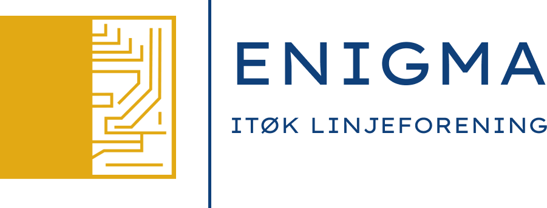

# Enigma nettside



## Installasjon

### 1. Installer Node, Git og VS_Code.

- [nodejs.org](https://nodejs.org/)

- [git-scm.com/downloads](https://git-scm.com/downloads)

- [code.visualstudio.com](https://code.visualstudio.com/)

### 2. Klon og installer prosjektet.

#### 1. Åpne Terminal (Windows Powershell)

#### 2. Naviger inn i den mappen du ønsker å ha prosjektet.

- ````
    cd Documenst/min-mappe
    ````
#### 3. Klon repoet

- ````
    git clone https://github.com/Enigmauib-web/Enigma-web.git
    ````
#### 4. Naviger inn i mappen.

- ````
    cd Enigma-web
    ````

#### 5. Installer dependencies

- ````
    npm install
    ````

## Start prosjektet

#### 1. Åpne mappen i VS-Code. Fra terminal kan dette gjøres ved å skrive inn følgende kommando i terminal (Powershell)

- ````
    code .
    ````

- **NB:** sørg for å være navigert inn i `./Enigma-web` mappen. 


#### 2. Åpne termial i VS-Code.

- Ctrl + J (Windows / Linux)

- Cmd + J (Mac)

#### 3. Start lokal Docusaurus server

- ````
    npm run start
    ````

#### 4. Gå til `localhost:3000` eller `127.0.0.1:3000` i chrome. 